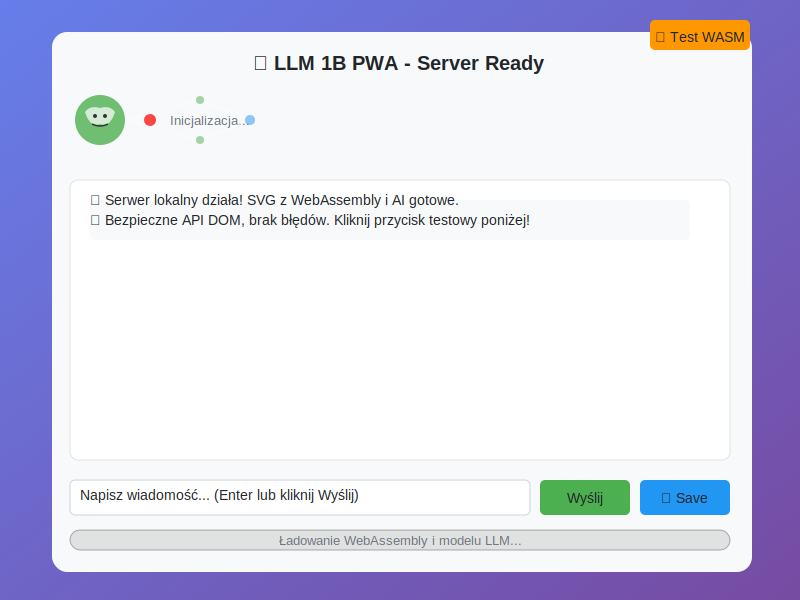

# llm-svg
SVG file with one file PWA and WebAssembly based LLM implementation
To bardzo ambitny projekt! Osadzenie LLM 1B w PWA z WebAssembly i SVG wymaga kilku kroków. Oto kompletny przewodnik:Teraz pokażę Ci konkretne kroki implementacji prawdziwego LLM:




Oto proste one-linery do uruchomienia lokalnego serwera z pobranym SVG:

## 🚀 Python (najłatwiejszy)
```bash
# Pobierz i uruchom jedną komendą
curl -o llm-pwa.svg "data:image/svg+xml,<svg>...</svg>" && python3 -m http.server 8000
python3 -m http.server 8000
```

## 🔥 Node.js (npx - bez instalacji)
```bash
# Instant server
npx serve ./svg -p 8000
```
```bash
# Instant server
npx serve ./html -p 8082
```

## ⚡ PHP (jeśli masz PHP)
```bash
php -S localhost:8000
```

## 🌐 Python one-liner z auto-otwarciem
```bash
python3 -c "import http.server,socketserver,webbrowser,threading; s=socketserver.TCPServer(('',8000),http.server.SimpleHTTPRequestHandler); threading.Thread(target=s.serve_forever).start(); webbrowser.open('http://localhost:8000/llm.pwa.svg'); print('Server: http://localhost:8000 - Ctrl+C to stop'); s.serve_forever()"
```

## 📂 Kompletny skrypt do pobrania i uruchomienia## 🎯 **Super proste one-linery:**

### Python (najbardziej uniwersalny)
```bash
python3 -m http.server 8000 && open http://localhost:8000/svg/llm.pwa.svg
```

### Z auto-otwarciem w przeglądarce
```bash
python3 -m http.server 8000 & sleep 2 && open http://localhost:8000 && fg
```

### Node.js (jeśli masz npm)
```bash
npx serve . -p 8000
```

### PHP one-liner
```bash
php -S localhost:8000 & open http://localhost:8000/llm.pwa.svg
```

## 🔥 **Ultimate one-liner** (pobierz + uruchom):
```bash
curl -s "https://example.com/llm-pwa.svg" > llm-pwa.svg && python3 -m http.server 8000 & sleep 1 && open http://localhost:8000/llm-pwa.svg
```

## 💎 **Windows PowerShell**
```powershell
python -m http.server 8000; Start-Process "http://localhost:8000/llm.pwa.svg"
```

## 🛠️ **Użycie skryptu:**
```bash
# Pobierz skrypt
curl -o llm.pwa.sh https://gist.github.com/...

# Uruchom
chmod +x llm.pwa.sh
./llm.pwa.sh

# Lub z custom portem
./llm.pwa.sh 3000
```

## 🎪 **Docker one-liner** (dla zaawansowanych)
```bash
echo '<svg>...</svg>' > llm-pwa.svg && docker run -p 8000:8000 -v $(pwd):/usr/share/nginx/html nginx
```

**Najprostszy sposób:** Skopiuj jeden z Python one-linerów - działają na Mac, Linux i Windows! 🚀

## 1. Struktura plików PWA

```
projekt/
├── index.html (jak powyżej)
├── manifest.json
├── sw.js (Service Worker)
├── models/ (folder z modelami)
└── wasm/ (pliki WebAssembly)
```

## 2. Manifest.json dla PWA

```json
{
  "name": "LLM PWA Assistant",
  "short_name": "LLM PWA",
  "description": "Lokalny asystent AI",
  "start_url": "/",
  "display": "standalone",
  "background_color": "#667eea",
  "theme_color": "#2196F3",
  "icons": [
    {
      "src": "icon-192.png",
      "sizes": "192x192",
      "type": "image/png"
    }
  ]
}
```

## 3. Rzeczywiste biblioteki do LLM

**Opcja A: ONNX Runtime Web**
```javascript
import * as ort from 'onnxruntime-web';

async function loadModel() {
    // Załaduj model w formacie ONNX
    const session = await ort.InferenceSession.create('models/llm-1b.onnx');
    return session;
}
```

**Opcja B: Transformers.js**
```javascript
import { pipeline } from '@xenova/transformers';

const generator = await pipeline('text-generation', 'Xenova/gpt2', {
    quantized: true // Dla lepszej wydajności
});
```

**Opcja C: WebLLM (ChatGLM, Llama)**
```javascript
import * as webllm from "@mlc-ai/web-llm";

const engine = new webllm.MLCEngine();
await engine.reload("Llama-2-7b-chat-hf-q4f16_1");
```

## 4. Optymalizacje dla 1B modelu

```javascript
// Konfiguracja dla małego modelu
const modelConfig = {
    // Quantization - zmniejsza rozmiar
    quantized: true,
    // Batch size = 1 dla lepszej responsywności
    batchSize: 1,
    // Ograniczona długość kontekstu
    maxLength: 512,
    // Web Workers dla obliczeń w tle
    useWebWorker: true
};
```

## 5. Service Worker (sw.js)

```javascript
const CACHE_NAME = 'llm-pwa-v1';
const urlsToCache = [
    '/',
    '/index.html',
    '/models/llm-1b.onnx', // Model cache
    '/wasm/onnxruntime.wasm'
];

self.addEventListener('install', event => {
    event.waitUntil(
        caches.open(CACHE_NAME)
            .then(cache => cache.addAll(urlsToCache))
    );
});
```

## 6. Konkretne modele 1B do użycia

- **DistilGPT-2** (~300MB po quantization)
- **TinyLlama-1.1B** (~600MB)
- **MobileBERT** (~100MB)
- **GPT-2 small** (~500MB)

## 7. Wyzwania i rozwiązania

**Rozmiar modelu:**
- Użyj quantization (INT8/INT4)
- Progressive loading
- Kompresja GZIP

**Wydajność:**
- Web Workers
- WebAssembly SIMD
- GPU acceleration (WebGL/WebGPU)

**Pamięć:**
- Streaming inference
- Model sharding
- Cache management

